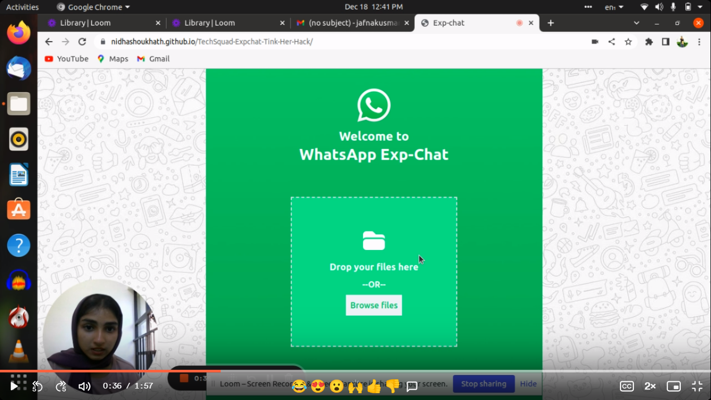

# WhatsApp Exp-Chat
### WhatsApp Exp-chat is a simple tool to convert an exported WhatsApp chat text file into a readable chat with a cool UI.

The aim of this project is to regenerate exported whatsapp chats into more human readable format so that we can store whatsapp chats in plain text and use it along with WhatsApp Exp-chat to view the chats in the future.

## Here's why
Especially with the coming of pandemic, the use of social media platforms for businesses, learning, teaching, marketing etc. has increased exponentially. Thus the use of whatsapp too. Hence people sometimes are not able to document them or keep them organized for future references.

WhatsApp Exp-Chat is a solution for this problem. This tool could convert the exported text file into a readable chat. This can be later modified according to the user’s need and later can be downloaded as pdf and can be used in the future.

## Features
* Seamless drag and drop ui with txt file support.
* Export the chat as a pdf file.
* Simple app UI with minimal user interaction.

### May be implemented in the future
* Custom chat theme support. 
* Bulk convert with zip file upload.
* Support media files.

## Project Walkthrough
### deployed link :

https://nidhashoukhath.github.io/TechSquad-Expchat-Tink-Her-Hack/

### Introduction and explanation video :

[](https://www.loom.com/share/494c894d284947ffb904f682dc416498)

## Built with
* Html 
* Tailwind css
* JavaScript

## Example Run

### 1. Drag and drop your files or browse files:


### 2. Chat exported to readable attractive form:


### 3. User may download the pdf file using the download button at the top right of the screen.

### 4. User may refresh the page using the back-arrow icon at the top left of the screen.

## How to Setup

The first thing to do is to clone the repository:

```sh
$ git clone https://github.com/nidhashoukhath/TechSquad-Expchat-Tink-Her-Hack
$ cd TechSquad-Expchat-Tink-Her-Hack
```
Then run the index.html using live server preview

## Team TechSquad 
[Nidha Shoukhath](https://github.com/nidhashoukhath)

[Fathima Busthana](https://github.com/fathima-busthana)

[Jafna K](https://github.com/Jafnak)

[Juwairiyah CO](https://github.com/juwairiyahco)

