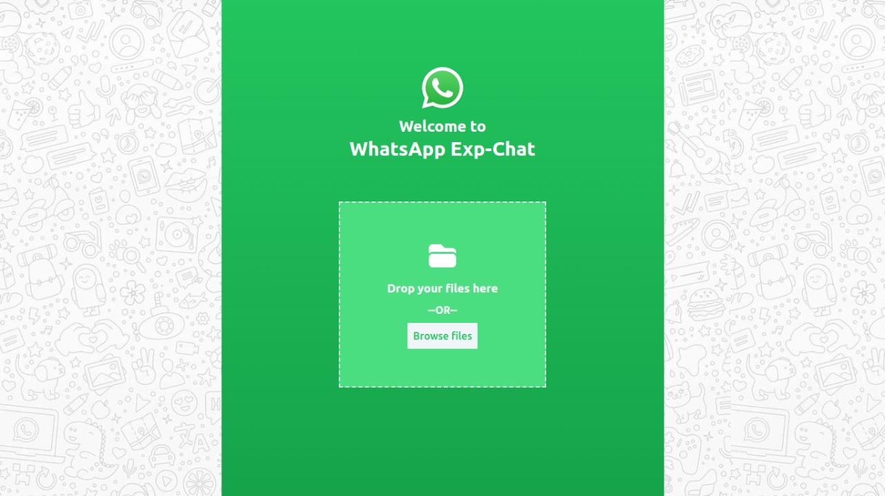
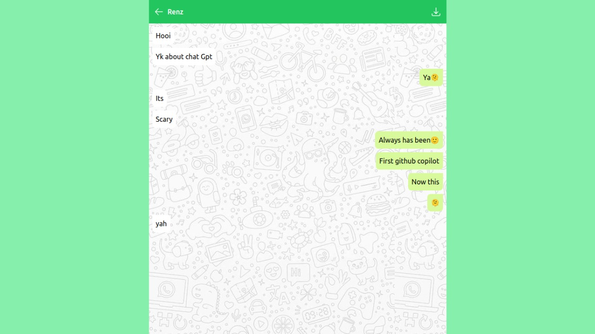

# WhatsApp Exp-Chat
### WhatsApp Exp-chat is a simple tool to convert an exported WhatsApp chat text file into a readable chat with a cool UI.

## Project Walkthrough
https://nidhashoukhath.github.io/TechSquad-Expchat-Tink-Her-Hack/

## Example Run

### 1. Drag and drop your files or browse files:



### 2. Chat exported to readable attractive form:



### 3. User may download the pdf file using the download button at the top right of the screen.

### 4. User may refresh the page using the back-arrow icon at the top left of the screen.

## How to Setup

the first thing to do is to clone the repository:

```sh
$ git clone https://github.com/nidhashoukhath/TechSquad-Expchat-Tink-Her-Hack
$ cd TechSquad-Expchat-Tink-Her-Hack
```
Then run the index.html using live server preview

## Team TechSquad 
[Nidha Shoukhath](https://github.com/nidhashoukhath)

[Fathima Busthana](https://github.com/fathima-busthana)

[Jafna K](https://github.com/Jafnak)

[Juwairiyah CO](https://github.com/juwairiyahco)

